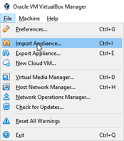
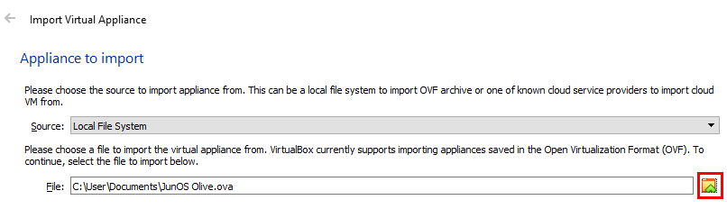
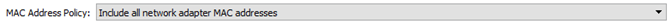
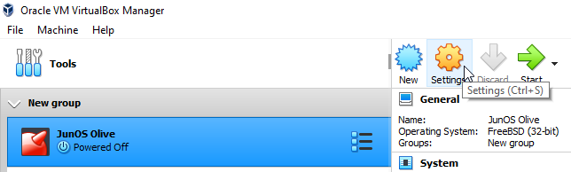
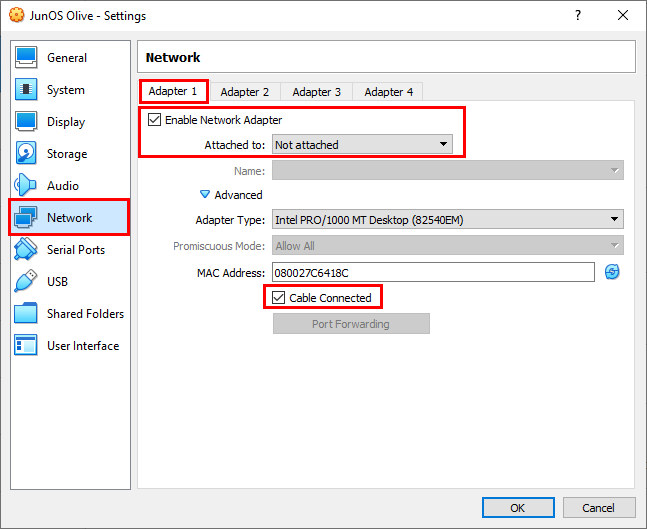
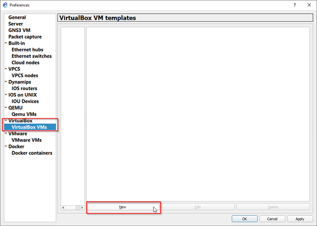
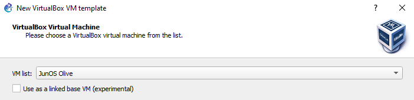
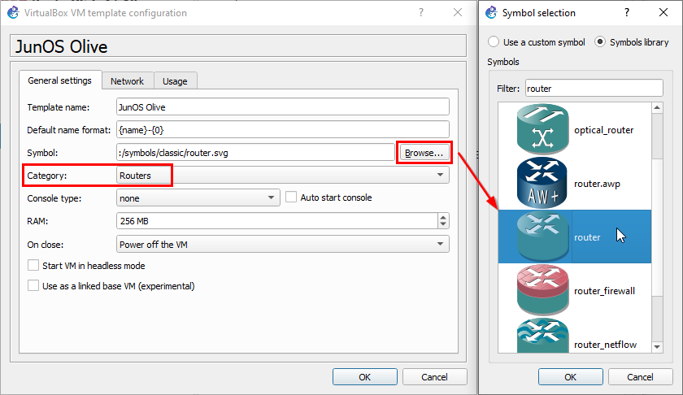
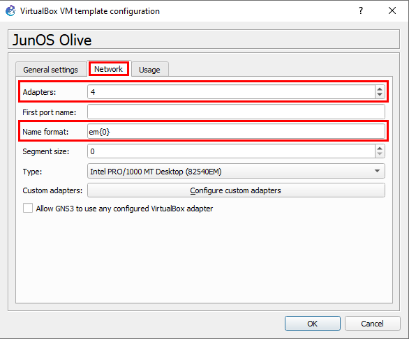

# Agregar Dispositivo Router con Sistema Operativo JunOS, a GNS3

Para este procedimiento se requiere el archivo _JunOS Olive.ova_ con la imagen del Router, instalación de VirtualBox ([descarga](https://www.virtualbox.org/wiki/Downloads)) y GNS3.

En primer lugar se muestra como se importa la imagen del router y la configuración necesaria en VirtualBox. Luego, de esto se agrega la Máquina Virtual (VM) a GNS3.

## Importar máquina virtual con sistema operativo JunOS

1. Abra VirtualBox y haga Click en archivo (File) y seleccione la opción para importar como se muestra a continuación.

  

2.	Seleccione el archivo desde la ruta donde está el archivo 

  

3.	Modifique la política de asignación de direcciones MAC para incluir las MAC de los adaptadores de red y haga Click en importar.

  

4.	Luego de completar el proceso de importación, seleccione el Router y haga Click en configuraciones

  

5.	Realice la configuración de red mostrada en la Figura para que el Router/Firewall tenga 3 interfaces de red Ethernet. **Repita este paso para los adaptadores de red 2 y 3**

  

7. _Click_ en OK. **No** inicialice la VM con el RouterOS todavía.

## Configuración en GNS3 de JunOS

1.	Haga _Click_ en Preferencias que se encuentra en el menú editar. Una vez se abra la ventana, seleccione la opción de VirtualBox en la columna izquierda y haga Click en Nuevo.

  

2. Seleccione el dispositivo JunOS Olive que aparece en el listado y Click en Finalizar.

  

3. Seleccione el dispositivo y Click en Editar para configurar las características del Firewall/Router para visualización y usabilidad en GNS3. Configure el símbolo del dispositivo, la categoría y su modo de ejecución.

  

  
4. En la pestaña de Red, configure las interfaces del Firewall/Router como se muestra a continuación y haga Click en OK.

  

5. Aplique los cambios y finalice con OK. Luego de esto, el dispositivo aparece en el selector de dispositivos en la parte de routers.

## Acceder a la configuración del Router con Sistema Operativo JunOS

Para utilizar el dispositivo en GNS3, agréguelo al área de trabajo, realice las conexiones pertinentes de la topología a implementar e inícielo haciendo click derecho y luego en _Start_. Para configurar el dispositivo usando comandos, ingrese el usuario y la contraseña en la ventana (consola) que despliega VirtualBox.