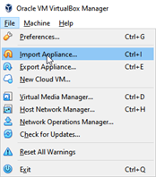
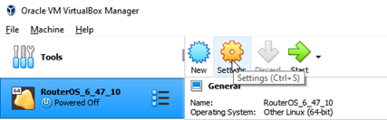
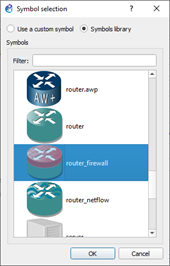

# Agregar Dispositivo Router/Firewall con Sistema Operativo RouterOS, a GNS3

Para este procedimiento se requiere el archivo _RouterOS\_6\_47\_10.ova_ con la imagen del Router/Firewall, instalación de VirtualBox ([descarga](https://www.virtualbox.org/wiki/Downloads)) y GNS3.

En primer lugar se muestra como se importa la imagen del router y la configuración necesaria en VirtualBox. Luego, de esto se agrega la Máquina Virtual (VM) a GNS3.

## Importar máquina virtual con sistema operativo RouterOS

1. Abra VirtualBox y haga Click en archivo (File) y seleccione la opción para importar como se muestra a continuación.

  

2.	Seleccione el archivo desde la ruta donde está el archivo 

  

3.	Modifique la política de asignación de direcciones MAC para incluir las MAC de los adaptadores de red y haga Click en importar.

  

4.	Luego de completar el proceso de importación, seleccione el Router y haga Click en configuraciones

  

5.	Realice la configuración de red mostrada en la Figura para que el Router/Firewall tenga 3 interfaces de red Ethernet. **Repita este paso para los adaptadores de red 2 y 3**

  

6. Seleccione la cuarta interfaz y habilítela con los parámetros mostrados. Este adaptador de red permitirá la configuración del Router/Firewall.

  

7. _Click_ en OK. **No** inicialice la VM con el RouterOS todavía.

## Configuración en GNS3 de RouterOS

1.	Haga _Click_ en Preferencias que se encuentra en el menú editar. Una vez se abra la ventana, seleccione la opción de VirtualBox en la columna izquierda y haga Click en Nuevo.

  

2. Seleccione el dispositivo  y Click en Finalizar.

  

3. Editar las características del Firewall/Router para visualización y usabilidad en GNS3

  

4. Configure el símbolo del dispositivo, la categoría y su modo de ejecución.

   

5. En la pestaña de Red, configure las interfaces del Firewall/Router como se muestra a continuación y haga Click en OK.

  

6. Aplique los cambios y finalice con OK. Luego de esto, el dispositivo aparece en el selector de dispositivos de seguridad.

## Acceder a la configuración de Firewall/Router Mikrotik con Sistema Operativo RouterOS

Para utilizar el dispositivo en GNS3, agréguelo al área de trabajo, realice las conexiones pertinentes de la topología a implementar e inícielo haciendo click derecho y luego en _Start_. Para ingresar los comandos y configurar el dispositivo, siga el siguiente procedimiento. _No utilice Ether 4 en la topología. Recuerde que esta interfaz se utiliza para la configuración del router desde el Host_

1.	[Descargar](https://mikrotik.com/download) y ejecutar el software Winbox, el cual sirve para administrar y configurar RouterOS.

  

2.	Luego de ejecutado Winbox y el Firewall/router en GNS3, ir a la pestaña de vecinos (Neighbors), hacer Click en refrescar (Refresh). Luego, hacer doble Click en la dirección MAC que aparece en la ventana inferior. La información se completa automáticamente en la parte superior para luego hacer Click en conectar (Connect).

      * _NOTA 1: Para el caso del laboratorio el dispositivo por defecto no cuenta con contraseña para su configuración. En ambientes reales esto se debe evitar y por consiguiente es OBLIGATORIO asignar una contraseña robusta para el acceso a la configuración del dispositivo._
        

          
        

      * _NOTA 2: Para esta guía de laboratorio, el Sistema Operativo RouterOS no tiene una licencia comercial para utilizar indefinidamente. En este caso, la licencia tiene una duración de 23 horas aproximadamente mientras está en operación. Luego de este tiempo, el Firewall/Router no se podrá reconfigurar y deberá importar a VirtualBox el archivo .ova nuevamente._

        

          
        

3. En Winbox, en la columna izquierda, haga click en Terminal e ingrese los comandos según los requerimientos de su implementación.

