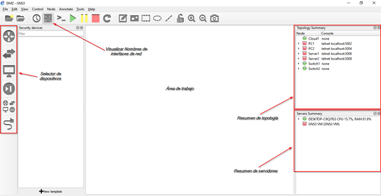
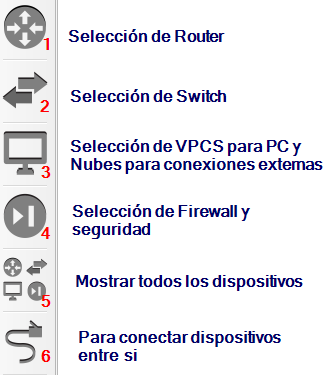
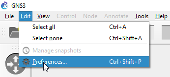
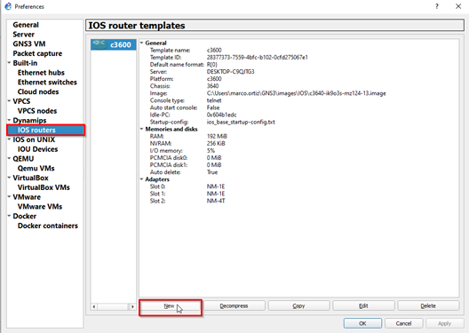
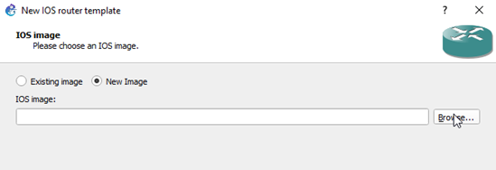
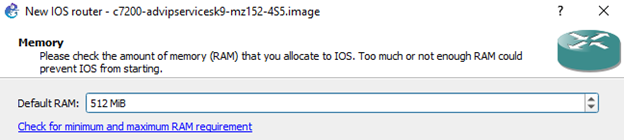
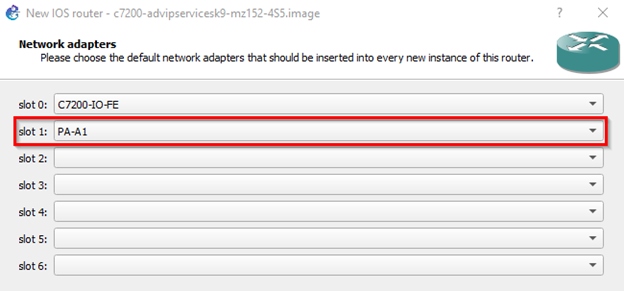
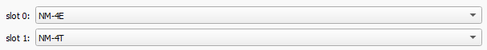
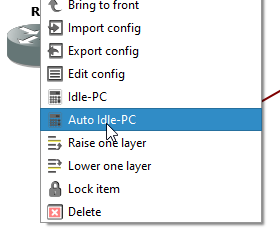

# Uso y configuraciones iniciales de GNS3

El ambiente de trabajo para GNS3 cuenta con las siguientes partes que se presentan en la Figura. Estas le permitirán agregar dispositivos al área de trabajo, realizar las conexiones, monitorear las conexiones y el estado activo o inactivo de los dispositivos (Resumen de Topología) de la topología y le muestra el nivel de procesamiento y memoria que utiliza el computador donde tiene instalado GNS3 (Resumen de servidores)

  

## Contenido
1. [Selector y conexión de dispositivos](#selector-de-dispositivos)
2. [Agregar Routers](#agregar-routers-c7200-y-c3600-a-gns3)
3. [Rendimiento](#rendimiento-de-gns3)
4. [Captura de paquetes](#captura-de-paquetes-de-datos)
5. [Acceso a consola de Router](#acceso-a-la-consola-de-routers)

## Selector de dispositivos

  

Por defecto no hay Routers disposnibles. Estos se agregan como se muestra en la siguiente parte. 

## Agregar Routers c7200 y c3600 a GNS3

### 1.	Haga Click en Preferencias que se encuentra en el menú editar.

  

### 2. Seleccione IOS Routers, y _click_ en nuevo

  

### 3. Seleccione la imagen del dispositivo correspondiente y haga click en siguiente

  

#### 3.1 Para el router c7200
*Se recomienda cambiar la RAM a 256MB*

  

Agregue la interaz ATM a un _slot_ disponible

  

Hagla _click_ en siguiente y finalice con las opciones por defecto.

#### 3.2 para el router c3600

Para este router, deje la memoria RAM por defecto (192MB) y configure en _slots_ disponibles, 4 interfaces Ethernet y 4 seriales.

  

Hagla _click_ en siguiente y finalice con las opciones por defecto.

## Rendimiento de GNS3

Este paso es opcional pero es ***recomendado*** para mejorar el rendiemto de GNS3. 

Luego de crear la topología e iniciar los Routers, haga click derecho sobre cualquiera de ellos y seleccione la opción _Auto Idle-pc_. 

  

El valor generado queda aplicado a todos los routers con la misma referencia y eventualmente será necesario repetirlo para futuros proyectos.

Tenga en cuenta los valores mostrados en el _resumen de servidores_ para evidenciar un cambio significativo en el uso de su CPU.

## captura de paquetes de datos

La captura o traza de paquetes se realzia en GNS3 usando Wireshark. Esta captura se puede realizar en cada enlace haciendo _click_ derecho sobre el _cable_ y seleccionando las opciones adecuadas para cada tipo de enlace. 

Por ejemplo, para inciar la captura en un enlace de tipo Frame Realy se puede realizar lo siguiente

  

## Acceso a la consola de Routers 

Para acceder a la consola del Router y poder configurar el dispositivo ingresando los comandos según los requermientos de la red a implementar, se hace _click_ derecho sobre el dispositivo y después en consola.

  

