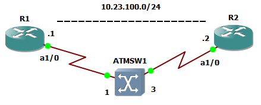
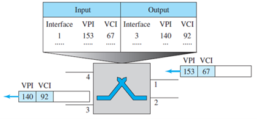
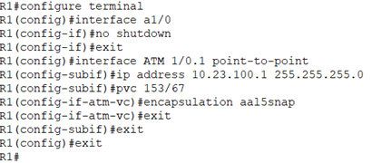
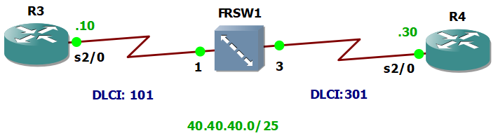
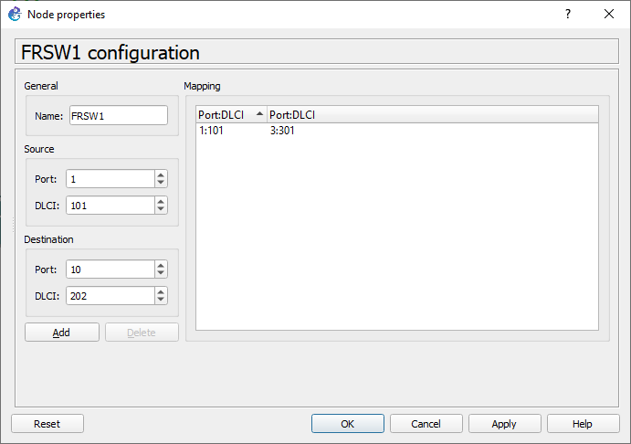
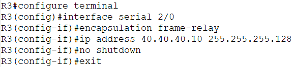
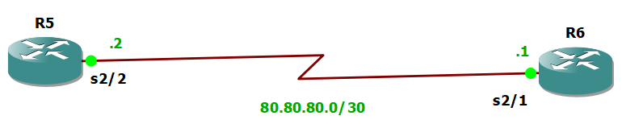
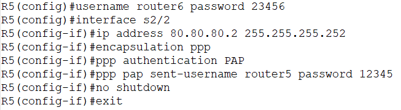

# Configuraciones de enlaces ATM, Frame Relay y PPP en routers Cisco en GNS3

  Configuraciones básicas para enlaces ATM, Frame Relay y PPP en interfaces, usando router c7200 para el primero y c3600 para los dos últimos. Adicionalmente, se muestra la configuración de las direcciones IPv4 en las interfaces. La asignación de estas direcciones de Red, se realiza usando los mismos comandos (cambiando la dirección y máscara) para todos los casos.
  
## Contenido

1. [configuración de ATM](#configuraci%C3%B3n-de-atm)
2. [Configuración de Frame Relay](#configuraci%C3%B3n-de-frame-relay)
3. [Configuración de PPP](#configuración-ppp-con-autenticación-pap)

## Configuración de ATM

Creación de circuito virtual ATM en configuración punto-a-punto para la siguiente topología de red.

  

### Configuración de Switch ATM
Antes de conecytar dispositivos del enlace, se configuran las interfaces en la Tabla del switch ATM, con los identificadores de Circuito Virtual (Virtual Circuit Identifier - VCI) y Camino Virtual (Virtual Path Identifier - VPI).

   
  <em>Forouzan, Data Communications and Networking, 5ed. NY, USA: McGraw-Hill, 2013, pp. 1226. Sec. 14.4 </em>

Para configurarlo en GNS3 y agregar los identificadores e interfaces correspondientes, haga click derecho sobre el switch y luego en configuración.

  

### Configuración de Router

Luego de configurar el Switch ATM, se procede a realizar las conexiones correspondientes y a iniciar los Routers R1 y R2. Luego, se procede con su configuración haciendo click derecho sobre el dispositivo y después en consola.

  

A continuación se muestran los comandos a ingresar en el R1 para este ejemplo. De manera similar se procede con R2.

  

## Configuración de Frame Relay

Creación de circuito virtual Frame Relay configuración para la siguiente topología de red.

  

Para configurarlo en GNS3 y agregar los identificadores e interfaces correspondientes, haga click derecho sobre el switch y luego en configuración. Configura los DLCI y puertos según corresponda y haga click en _add_. 

  

Luego de configurar el Switch Frame Relay, se procede a realizar las conexiones correspondientes y a iniciar los Routers R3 y R4 para acceder a consola e ingresar la siguiente configuración

  

## Configuración PPP con autenticación PAP

Para la siguiente topología,

  

se muestran los comandos que permiten la configuración del protocolo para Router 5

  

