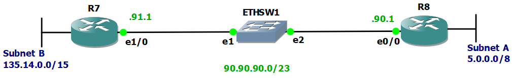
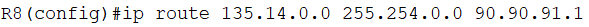
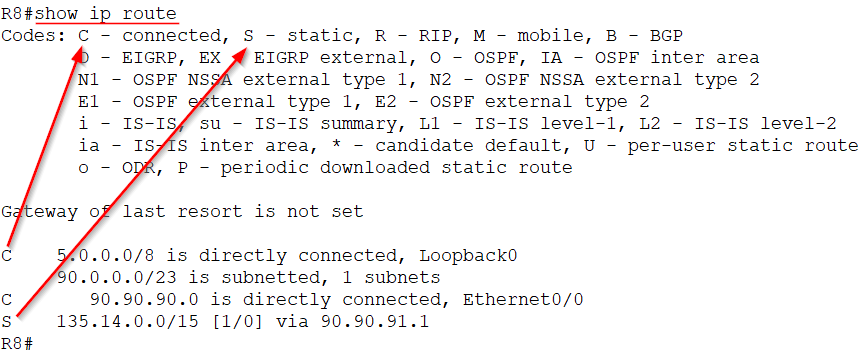

# Configuración de enrutamiento

Configuración de enrutamiento estático sobre un enlace Ethernet usando el router c3600 para la siguiente topología y direcciones. 

  

La configuración del enlace permite la comunicación únicamente dentro del mismo enlace. Para comunicarse entre diferentes enlaces, se puede utilizar enrutamiento estático o dinámico. 

Con la topología anterior, para establecer comunicación de red entre la Subred A y B, los paquetes pasan por un enlace que ***No está directamente conectado*** a la Subred A ni a la Subred B. Por esto, se requiere la implemntación de un mecanismo de enrutamiento.

## Enrutamiento estático 
El siguiente comando se ejecuta en Router 8 y permite la comunicación desde la Subred A hacia la Subred B, únicamente en ese sentido. Para que la comunicación sea bidireccional se ejecuta el comando recíproco en Router 7.

  

## Verificar configuración de enrutamiento.

Para ver la tabla de enrutamiento según la configuración del router, 

`show ip route`

  

