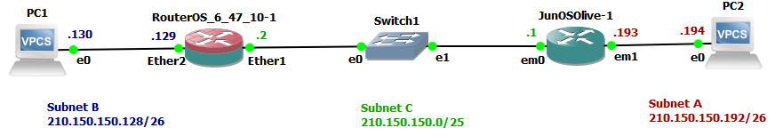

# Configuración de enrutamiento

## Contenido

- [Configuración de enrutamiento](#configuración-de-enrutamiento)
  - [Contenido](#contenido)
  - [Introducción](#introducción)
  - [Enrutamiento estático](#enrutamiento-estático)
  - [Verificar configuración de enrutamiento.](#verificar-configuración-de-enrutamiento)
  - [Enrutamiento dinámico RIPv2](#enrutamiento-dinámico-ripv2)
    - [Configuración de _RouterOS\_&\_47\_10\-1_](#configuración-de-routeros__47_10-1)
    - [Verificación de configuración de _RouterOS\_&\_47\_10\-1_](#verificación-de-configuración-de-routeros__47_10-1)
    - [Configuración de _JunOS Olive_](#configuración-de-junos-olive)
    - [Verificación de configuración de _JunOS Olive_](#verificación-de-configuración-de-junos-olive)
  - [Configuración de MTU](#configuración-de-mtu)
    - [Configuración de MTU en _RouterOS\_&\_47\_10\-1_](#configuración-de-mtu-en-routeros__47_10-1)
    - [Configuración de MTU en _JunOS Olive_](#configuración-de-mtu-en-junos-olive)
  - [Configuración RIPv2 en Cisco IOS](#configuración-ripv2-en-cisco-ios)
    - [Configuración de MTU en _Cisco IOS_](#configuración-de-mtu-en-cisco-ios)

## Introducción

La configuración del enlace permite la comunicación únicamente dentro del mismo enlace. Para comunicarse entre diferentes enlaces, se puede utilizar enrutamiento estático o dinámico. 


## Enrutamiento estático 
Configuración de enrutamiento estático sobre un enlace Ethernet usando el router c3600 con Sistema Operativo (OS) Cisco IOS, para la siguiente topología y direcciones. 

<p align="center">
  
</p>

Con la topología anterior, para establecer comunicación de red entre la Subred A y B, los paquetes pasan por un enlace que ***No está directamente conectado*** a la Subred A ni a la Subred B. Por esto, se requiere la implemntación de un mecanismo de enrutamiento.

El siguiente comando se ejecuta en Router 8 y permite la comunicación desde la Subred A hacia la Subred B, únicamente en ese sentido. Para que la comunicación sea bidireccional se ejecuta el comando recíproco en Router 7.

<p align="center">
  
</p>

## Verificar configuración de enrutamiento.

Para ver la tabla de enrutamiento según la configuración del router, 

`show ip route`

<p align="center">
  
</p>

## Enrutamiento dinámico RIPv2

Para esta sección, se utiliza una topología de red similar a la anterior. Sin embargo, esta vez se utilizan los _Routers_ Con Sistema Operativo (OS) _JunOS_ (Juniper) y _RouterOS_ (Mikrotik).

<p align="center">
  
</p>

A continuación se muestra la configuración de los dispositivos para establecer comunicación entre PC1 y PC2, utilizando RIPv2. Al finalizar, se modifica el MTU de la subred C.

### Configuración de _RouterOS\_&\_47\_10\-1_

La configuración se realiza desde la terminal en Winbox.
Los siguientes comandos permiten la conficuración de las direcciones IPv4 en las interfaces _ether1_ y _ether2_.

```
/ip address add interface=ether1 address=210.150.150.2 netmask=255.255.255.128 disabled=no
/ip address add interface=ether2 address=210.150.150.129 netmask=255.255.255.192 disabled=no
```

Después, se habilita el protocolo RIPv2 para que transmita los mensajes de actualización (_Request-Response_) únicamente por _ether1_ pero que incluya la información de la Subred B. Esto significa la configuración de la interfaz _ether2_ como **pasiva**.

```
/routing rip interface add interface=ether1 passive=no send=v2 receive=v2 authentication=none
/routing rip interface add interface=ether2 passive=yes authentication=none

/routing rip network add network=210.150.150.0/25
/routing rip network add network=210.150.150.128/26
```

### Verificación de configuración de _RouterOS\_&\_47\_10\-1_

La configuración se puede verificar desde la interfaz gráfica de Winbox o en el Terminal, usando los siguientes comandos. 

- Mostrar las direcciones IP asignadas.

```
/ip address print
```
- Mostrar interfaces y configuración de RIP
```
/routing rip interface print
/routing rip network print
```
- Mostrar tablas de enrutamiento
```
/ip route print 
/routing rip route print
```
Documentación detallada en [Manual:Routing/RIP](https://wiki.mikrotik.com/wiki/Manual:Routing/RIP).

### Configuración de _JunOS Olive_

Acceda al _modo operacional_ del Router, ejecutando el comando _cli_.

```
root@% cli
```

En el _modo operacional_, ingrese el comando _configure_ para acceder al _modo de configuración_.
```
root> configure
```

- NOTA1: Identifique cada modo de operación según el símbolo en el _prompt_. 
  - \> operational mode. 
  - \# configuration mode.

- Documentación adicional en [CLI User Guide for Junos OS](https://www.juniper.net/documentation/us/en/software/junos/cli/cli.pdf).

En el _modo de configuración_ los siguientes comandos configuras las direcciones IPv4 de las interfaces _em0_ y _em1_.

```
root# set interfaces em0 unit 0 family inet address 210.150.150.1/25
root# set interfaces em1 unit 0 family inet address 210.150.150.193/26
```

Después, se habilita RIPv2 creando un grupo de interfaces que trabajaran con este protocolo. Solo se incluye la interfaz _em0_ ya que _em1_ opera como interfaz pasiva. Esto último debido a que PC2 es un host que no responde peticiones RIPv2 y además, no necesita recibir la información de enrutamiento ya que esta le es asignada estáticamente.

```
root# set protocols rip group grupo-rip export aviso-de-rutas-con-rip
root# set protocols rip group rip-group neighbor em0
```
Se crean las políticas de enrutamiento para enviar mensajes de aviso que incluyan las subredes de las interfaces directamente conectadas y las demás rutas conocidas.
```
root# set policy-options policy-statement aviso-de-rutas-con-rip term 1 from protocol direct
root# set policy-options policy-statement aviso-de-rutas-con-rip term 1 from protocol rip
root# set policy-options policy-statement aviso-de-rutas-con-rip term 1 then accept

```
- **Aplicar cambios**
```
root# commit
```

### Verificación de configuración de _JunOS Olive_

La configuración se puede verificar desde la consola, usando los siguientes comandos. 

- Mostrar las direcciones IP asignadas.

```
root> show interfaces em0
root> show interfaces em1
root# show interfaces em0
root# show interfaces em1
root# run show interfaces terse
```
- Mostrar interfaces y configuración de RIP
```
root> show rip neighbor
root# show protocols rip
root# show policy-options
```
- Mostrar tablas de enrutamiento
```
root> show route table inet.0
root> show route protocol rip
root> show route advertising-protocol rip
root> show route receive-protocol rip
```

- otros
```
root# show | display set
```

Más información en [Example: Configuring RIP](https://www.juniper.net/documentation/en_US/junos/topics/topic-map/rip-basic.html).


## Configuración de MTU

A continuación se muestra como modificar el MTU en RouterOS y JunOS. En particular, para este ejemplo se modifica el MTU de la subred C a 200.

### Configuración de MTU en _RouterOS\_&\_47\_10\-1_

Se elige la interfaz _ether1_, ya que esta está conectada a la subred de interés, que para este ejemplo es la subred C. Desde la Terminal, ingrese el siguiente comando.

```
/interface ethernet set ether1 mtu=200
```

Para verificar el MTU en las interfaces, ingrese el siguiente comando.

```
/interface ethernet print
```

### Configuración de MTU en _JunOS Olive_

Se elige la interfaz _em0_, ya que esta está conectada a la subred de interés, que para este ejemplo es la subred C. Desde la Terminal, ingrese los siguientes comandos desde el _modo de configuración_.

```
root# edit interfaces em0 unit 0 family inet 
root# set mtu 200
root# commit
root# exit
```
para verificar el MTU en _em0_, ingrese el siguiente comando desde el _modo operacional_.

```
root> show interfaces em0
```

## Configuración RIPv2 en Cisco IOS

En este otro ejemplo se muestra la configuración de R3, que se encuentra dentro de la siguiente topología de red. Para la configuración de RIPv2, solo se muestran los comandos necesarios para R3 y por consiguiente, solo se muestra la sección de la topología relevante para tal fin.


<p align="center">
  
</p>

Desde el _modo de configuración global_ se configura la versión 2 del protocolo, indicando las subredes que avisará a los vecinos y se configura la interfaz e0/0 como pasiva debido a que PC1 es un host que no responde peticiones RIPv2 y además, no necesita recibir la información de enrutamiento ya que esta le es asignada estáticamente.

```
R3(config)#router rip
R3(config-router)#version 2
R3(config-router)#network 199.2.20.8
R3(config-router)#network 199.2.20.4
R3(config-router)#no auto-summary
R3(config-router)#passive-interface ethernet0/0
R3(config-router)#exit
```

### Configuración de MTU en _Cisco IOS_

Debido a que el enfoque de esta guía se basa en el uso de GNS3, el MTU se modifica desde la capa de red, utilizando los siguientes comandos desde el _modo de ejecución global_

```
R3(config)#interface ethernet0/0
R3(config-if)#ip mtu 200
R3(config-if)#exit
```